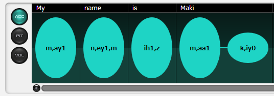
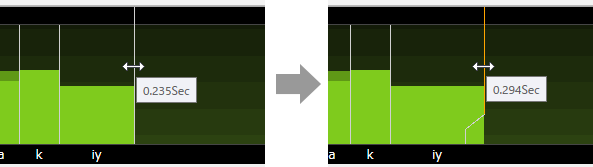

原文：[CeVIO AI ユーザーズガイド ┃ 音素グラフ（英語ボイス）](https://cevio.jp/guide/cevio_ai/talktrack/phoneme_english/)

---
在这里修正单词的重音，调整每个音素的音高、长度和音量。

## 调整重音

「ACC」按钮表示的画面用于调整重音。它能以三个级别调整英语的重音（stress）。

单击椭圆时，重音会在 0→1→2→0 间变化。

## 调整音高 / 音长 / 音量

「PIT」按钮表示的画面用于调整音高和音长。

「VOL」按钮表示的画面用于调整音量和音长。

PIT 屏幕的背景每八度有一个渐变，VOL 屏幕的背景每 10 dB 有一个渐变。

### 调整音高或音量

在条形图上用鼠标上下拖动（鼠标左键按住），便可根据鼠标的移动修改长条柱。也可以左右移动，或是按住 ++shift++ 键再往左（或右）移动，来横向调整音素图。

也可以将鼠标光标放在长条柱上，然后上下滚动鼠标滚轮来调整。

\* 在放大显示时按住 ++alt++ 键，可以用鼠标滚轮向上 / 向下进行调整。

\* 音高的变化单位是 100 Cent，音量的变化单位是 1dB。

从上方的文字区域开始上下拖动，可以以单语单位调整音高 / 音量。

### 调整音长

拖动白色的竖线（调整后为橙色）来调整发音的长度。

双击垂直线，或是在点击或拖动时按住 ++ctrl++ 键，可以使其恢复到原来的音长。

从上方的文字区域开始左右拖动，可以以单语单位调整音长。

除了拖动垂直线外，还可以通过拖动文字区域或在文字区域上下滚动鼠标滚轮来调整音长。

当鼠标悬停在要调整的单词或音素上时，它会变为橙色。

以单语为单位调整音长时，会自动确保辅音与元音的比例。

!!! tip

    关闭右键菜单的「显示音长界限」，可以防止在调整音高或音量时不小心拖动音长调整线。

    （即使隐藏了，也依然可以通过音素图上下的文本区域来调整音长。）

    

### 显示缩放

在 PIT 和 VOL 屏幕上，音素图右下方的 [+] 和 [-] 按钮可以用来放大和缩小显示。

当屏幕很窄或者想进行微调时很有用。

还可以用快捷键 ++ctrl++ + 鼠标滚轮向上/向下进行垂直放大和缩小，用 ++ctrl+shift++ + 鼠标滚轮向上/向下进行水平放大和缩小。

## 恢复初始值

选择音素图右键的「恢复初始值」，可以将重音、音高、音长和音量恢复到调整前的状态。

双击调整后的音素图可以只将该部分的图恢复到初始值。按住 ++ctrl++ 键再拖动鼠标，可以将鼠标经过的区域恢复到其初始值。

## 滚动显示

除了滚动条之外，还可以按住鼠标中键拖动来滚动音素图。

也可以通过按住 ++shift++ 键然后上下拖动鼠标滚轮的方式来水平滚动；在放大显示时上下拖动鼠标滚轮则为垂直滚动。

## 试听

在音素图中点击，将从点击的位置开始试听。在试听过程中再次点击将停止试听。

在调整后自动开始试听的「自动试听」功能，可以用「自动试听按钮」来激活 / 停用。

如果在[选项](../option/index.md)中的「语音设置」中勾选了「音素图调整部分自动试听」，音素图将从调整点的前一个停顿处（如标点符号）开始自动播放，直到遇到调整点的后一个停顿处。

*[「显示音长界限」]: 長さのラインを重ねて表示 / Overlay Duration Lines
*[「音素图调整部分自动试听」]: 音素グラフの自動試聴で部分再生 / Partial replay with Phoneme Graph
