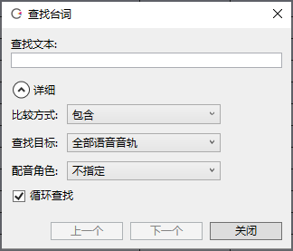

原文：[CeVIO AI ユーザーズガイド ┃ セリフの検索](https://cevio.jp/guide/cevio_ai/talktrack/search/)

---

台词行数很多的情况下，可以通过关键词快速显示所需的台词。

「读说」菜单的「搜索」、台词列表右键菜单的「搜索」以及快捷键 ++ctrl+f++ 都可以调出搜索窗口。

按 ++f3++ 键可以用上一次的搜索关键字和条件继续查找下一句台词（「下一个」）。

### 查找文本

*検索テキスト*

在这里输入待查找的文本。

### 详细

*詳細*

#### 比较方法

*比較方法*

默认情况下，搜索结果为包含搜索文本的行。也可以只搜索与搜索文本完全匹配的行。

#### 搜索对象

*検索対象*

选择是在全部读说轨道中搜索，还是只在选定音轨中搜索。

当开启了台词列表中的「显示别的音轨的台词」时，所有读说轨道都是默认的搜索目标；而当它被关闭时，选定的轨道是默认的搜索目标。

#### 配音角色

*キャスト*

默认不指定角色。也可以仅搜索指定了的角色的台词。

#### 循环查找

*ループ検索*

勾选时，查找到达末尾（开头）后，会返回开头（末尾）并继续查找。

#### 上一个、下一个

*前を検索、次を検索*

「上一个」从选择行开始往上搜索。
「下一个」从选择行开始往下搜索（默认）。

*[「下一个」]: 次を検索 / 
*[「上一个」]: 前を検索 / 
*[「显示别的音轨的台词」]: 別トラックのセリフ / 