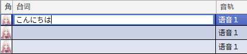
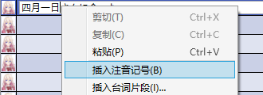
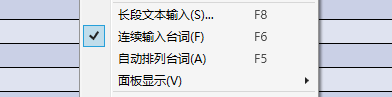
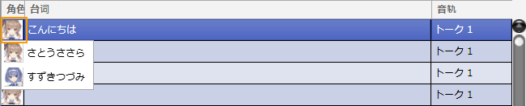
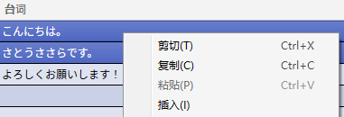
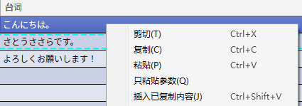
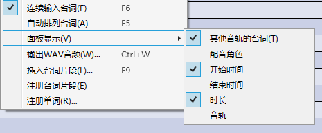
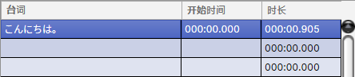

原文：[CeVIO AI ユーザーズガイド ┃ セリフの入力と編集](https://cevio.jp/guide/cevio_ai/talktrack/talk_01/)

---

## 输入台词

单击以选择一行，然后再次单击该行以进入文本输入状态。

在输入状态输入台词后，按 ++enter++ 键提交。

也可以单独使用键盘操作。按 ++enter++ 键或 ++down++ 键移动到下一行；按 ++up++ 键移动到上一行；按 ++f2++ 键输入选定的行。

（非输入状态下，不需要按 ++f2++ 键也可以直接输入文字。）

日语声库的台词可以使用全角平假名 / 片假名 / 汉字等自然句子。

英语声库的台词可以使用半角字母和数字等英文。

对于日语声库，每行台词的文字上限是 200；对于英语声库，上限是 500。

!!! tip "日语台词的输入提示"

    发音是由一行台词的整个句子决定的。句末的疑問符（？）或感嘆符（！）也会加入发音的判定中。

    没有読点（、）的长文和原为一句却分成多行输入的句子无法正确地发音。

    类似「こんにちは。○○さん。」这样的句子，中间的句点（。）会被替换为読点。

    即使读音相同，也可以通过改为同音字、平假名或片假名的方式，来寻找想要的发音。

    容易读错的人名或地名可以使用[注册单词](../talk_06)功能登记正确的读音。

### 插入注音记号  {#insert-ruby-brackets}

输入台词时，右键菜单的「插入注音记号」可以插入注音记号。

- 对于日语声库，会在光标位置插入 `《》`。 
    
    如果选中了文本，会额外插入一个表示注音开始的 `|`。

- 对于英语声库，会在光标位置的单词末尾插入 `[]`。

!!! info "输入日语注音"

    在 `《》` 内输入平假名或片假名来指定读法。

    （例）　今朝｜四月一日《わたぬき》さんに会った。　※ `|` 标明了注音的对象。

    （例）　こんにちは、四月一日《わたぬき》さん。　　※ 省略 `|` 时，注音对象将假定为从头开始。[^1]

    和[注册单词](../talk_06)时一样，在 `《》` 里也可以使用 `’` 让元音无声化。

!!! info "输入英语注音"

    在单词后紧跟的 `[]` 内输入发音记号来指定读法。

    音节（syllable）间使用 `|` 分割；音节内的音素使用 `,` 分割。

    元音后面应有一个表示重音（stress）的数字（如果省略则为 0）。

    0：非重音   1：主重音  2：次重音

    （例）　Sasara[s,ah1\|s,ah0\|r,ah0]

    （例）　Ando[ah1,n\|d,ow0]

    注音符号一览[请点击这里](../talk_01_english)。

### 连续输入台词

从右键菜单中开启「连续输入台词」，将进入台词连续输入模式。

如果想连续输入并播放台词时，请使用此功能。

- 按 ++enter++ 键结束这一行的编辑，自动移至下一行并进入编辑状态。

- 按 ++shift+enter++ 键结束这一行的编辑，自动移至上一行并进入编辑状态。

- 按 ++ctrl+enter++ 键结束这一行的编辑，按 ++esc++ 键撤销编辑，在空白行按 ++enter++ 键结束编辑。

## 台词的角色设定

点击配音栏，可以选择说出这一行台词的角色。

\* 从「音轨」菜单的「音轨配音角色」或音轨前端的角色设置变更角色，可以同时变更轨道内所有行的角色。

## 剪切/复制/粘贴

可以选择某一行进行剪切或复制，然后粘贴到另一行。

可以通过右键菜单，或者快捷键 ++ctrl+x++（剪切）、++ctrl+c++（复制）和 ++ctrl+v++（粘贴）执行操作。

状态、感情和音素图等内容也会一并粘贴，可以方便地重用已调整的台词。

\* 开启「显示别的音轨的台词」时，只会剪切 / 复制选中的行。

\* 也可以从剪贴板中粘贴来自其他软件的文本。

### 只粘贴参数

剪切或复制台词后，对待应用参数的行（允许多选）右键单击，选择「只粘贴参数」，就能不粘贴台词，只粘贴语速、音高、感情等参数。

\* 与通常的粘贴相同，即使该台词栏为空参数也能够填入。

## 选择多行

选择一行后，按住 ++shift++ 键再单击别的行，可以选择多行。

另外，++ctrl+a++ 可以全选行。[^2]

可以用于多行的剪切或复制，或同时给多行设置预设。

\* 预设仅会应用到角色匹配的行上。

## 删除行

按 ++del++ 键或在右键菜单中选择「删除」，可以删除选中的行。

## 插入行

右键菜单的「插入」，可以在选中行的位置插入新的一行。

剪贴 / 复制时会插入执行了该操作的那行，除此之外会插入空白行。

也可以从剪贴板中插入来自其他软件的文本。

\* 如果想插入空白行，可以先用 ++esc++ 键清除剪贴板。

## 添加空白行

菜单「语音」的「添加空白行」可以在台词列表末尾添加 10 行空白行。

## 变更面板显示

右键菜单的「面板显示」，可以变更列表的显示内容。

勾选「其他音轨的台词」，可以选择是否要在台词列表里显示所有语音轨道的台词。

「配音角色、开始时间、结束时间、时长、音轨」中的每一列都可以单独选择是否显示或隐藏。

### 其他音轨的台词

在台词列表中将选择的轨道外的台词一并显示。

### 配音角色

说出这句台词的角色。

### 开始时间

台词开始的时间（分:秒.微秒）。直接输入时间可以移动台词。

### 结束时间

台词结束的时间（分:秒.微秒）。可以把控一行结束时的时间。

### 时长

台词的长度（分:秒.微秒）。

### 音轨

台词的音轨。输入台词后选择别的轨道，可以轻松地将其移至别的轨道。

\*以下是一个隐藏了角色和音轨，只显示开始时间和长度的例子。

[^1]:译者注：实际情况是从 `《》` 的前一个停顿处（如标点符号）开始。
[^2]:译者注：只能全选该轨道内的行。
