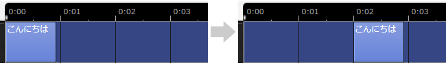
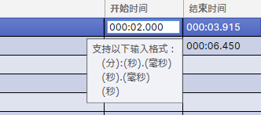
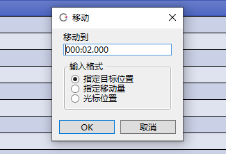
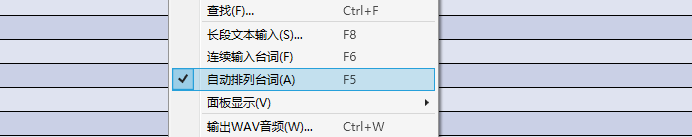

原文：[CeVIO AI ユーザーズガイド ┃ 発声タイミングの調整](https://cevio.jp/guide/cevio_ai/talktrack/talk_02/)

---

## 在时间轴上调整

在时间轴上，会显示代表输入的台词的元素（方块）。

拖动（鼠标左键按住并移动）元素来更改发声的时间。

按住 ++alt++ 键并拖动，可以将台词元素的左或右边缘吸附到最接近的秒（或小节，取决于标尺栏的时间基准）上。

按住 ++shift++ 键后单击台词元素，可以多选并同时移动这些台词。

### 设置音轨的内容为等间隔排列

从「音轨」的菜单里或在音轨上右键选择「设置音轨的内容为等间隔排列」后，该音轨内的全部台词将自动按一定的距离等间隔排列。（第一句台词的位置不会发生变化。）

\* 在[选项](../../option/index.md)的「语音设定」里可以修改台词间距离的设置。

## 在台词列表中调整

在台词列表的「开始时间」一栏双击，可以直接输入发声的时间。

可以在台词列表右键菜单的「面板显示」中设置「开始时间」的显示与否。

台词列表右键菜单的「移动」可以将选中行按指定的方式移动。

### 指定目标位置

直接指定移动的时间戳。

### 指定移动量

以相对于原始位置的正/负时间指定。

### 光标位置

移动到光标的当前位置。

## 台词的自动排列

开启自动排列时，输入台词后后续的台词会自动前后移动（以维持间距）。

更换角色或调整速度、感情或音素图的 LEN 后，它也会自动排列。

取消勾选可以将其关闭。此时编辑一句台词不会改变其他台词的位置，而且可以将台词移动到互相重叠的位置上。

（关闭后，即使输入一句新台词或者插入一条空行，原有的台词也不会移动。）

!!! tip

    推荐一开始先开着自动排列编辑台词，当不想修改台词位置的时候再将其关掉。

    \* 如果你想让这条轨道的台词跟其他轨道的台词重叠，请在选项的「语音设置」中关闭「多音轨自动排列」选项。

*[「面板显示」]: 表示 / View
*[「多音轨自动排列」]: マルチトラック自動整列 / Automatic multi-track alignment
*[「设置音轨的内容为等间隔排列」]: トラック内容を等間隔に整列 / Align Track Element
