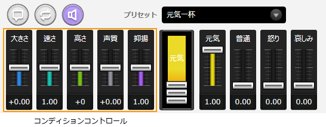
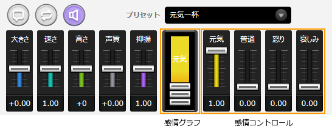
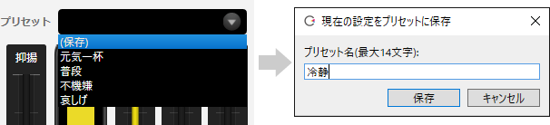

原文：[CeVIO AI ユーザーズガイド ┃ セリフの表情設定](https://cevio.jp/guide/cevio_ai/talktrack/talk_05/)

---

每句台词都有音量、语速、情绪等多种参数（值）。

调整这些参数，可以创造出想要的声音。

## 状态的设定

可以通过拖动（鼠标左键按住并移动）推子的方式来调整声音的音量、语速等。

也可以将鼠标光标放在推子上，然后上下滚动鼠标滚轮，来以 1 为单位调整。

在拖动或者滚动鼠标滚轮的时候按住 ++alt++ 键，可以将值同时应用到该轨道内的全部角色上。

### 音量

*大きさ / Volumn*

调整声音的大小。

### 语速

*速さ*

调整读台词的速度。

### 音高

*高さ*

调整声音的高低。

### 音色

*声質 / Alpha*

将声音变得更像大人或小孩子。

### 语调

*抑揚*

让声音更精神或更冷静。

## 情绪的设定

通过拖动元気或怒り（※）等推子，可以以所需的比例混合多种情绪。

也可以将鼠标光标放在推子上，然后上下滚动鼠标滚轮，来以 1 为单位调整。

在拖动或者滚动鼠标滚轮的时候按住 ++alt++ 键，可以将值同时应用到该轨道内的全部角色上。

※图为「さとうささら（佐藤莎莎拉）」的情绪。

### 情绪图

情绪图显示情绪合成的百分比。例如，如果元気和怒り都为 1.00[^1]，则百分比为各占 50%。

（“元気 1.00 + 怒り 1.00”与“元気 0.50 + 怒り 0.50”效果相同）

也可以拖动情绪图里的推子来直接修改百分比。

!!! info "每个角色的情绪"
    
    情绪参数会随着角色而异，如下列角色所示。

    - さとうささら … 元気，普通，怒り，哀しみ

    - IA … Bright, Normal, Strong, Dark

    - 小春六花 … 嬉しい，普通，怒り，哀しみ, 落ち着き

## 预设

轻轻一点就可以为台词添加预设好的情绪，或是添加喜欢的设置。

选中多行台词的情况下设置预设时，预设会应用到角色匹配的行上。

设置预设时按住 ++alt++ 键，可以将值同时应用到该轨道内所有与角色匹配的行上。

### 保存预设

选择（保存），可以将当前的参数设定命名并添加到预设中。

* 当覆盖已有的预设时，更改会应用到所有使用了该预设的行中。

### 删除预设

点击预设名字右侧的「×」即可删除预设。

### 默认的预设

经常使用的预设可以在[选项](../option/option.md)的「读说设定」里设为「默认的预设」，这样它就会变为空白行的预设，方便使用。

[^1]:译者注：原文写的是 100，但上面控制台的数字标的却是 1.00。推测这里沿用了 CS 版的数字但忘记修改了。
