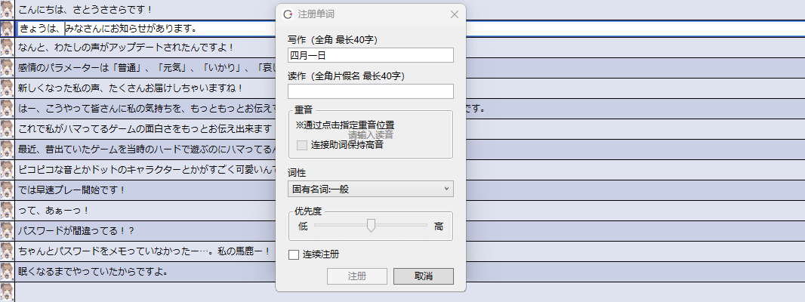

原文：[CeVIO AI ユーザーズガイド ┃ 単語の登録と辞書の管理（日本語ボイス）](https://cevio.jp/guide/cevio_ai/talktrack/talk_06/)

---

容易读错的人名或地名可以使用注册单词功能登记正确的读音。

## 注册单词

在「语音」菜单中，在台词列表中或在输入对话时，右键单击并选择「注册单词」。

（如果正在使用多个语种的声库，请在台词列表中选择日语声库。）

从台词列表选中一整行时，选择的句子会作为「写作」的范围；输入台词时则是选择范围内的词。

### 写作

以全角字符输入待注册单词的写法（最长 40 字）。[^1]

### 读作

以全角片假名输入待注册单词的发音（最长 40 字）。

例如，输入「トオキョオ」作为「東京」的发音。

!!! info "元音的无声化"

    举例来说，输入 `イェス` 会发「yesu」的音，最后的「ス」的音非常明显；但输入 `イェス’` 就会让元音「u」无声化，从而发出更自然的「yesU」的音。

    无声化的元音在音素图的调整界面里会以大写字母显示。

    效果因 `’` 附着的音拍而异。对「あ段」「え段」「お段」无效。

    \* 若想使元音无声化但不注册单词，请使用[注音记号](talk_01.md#insert-ruby-brackets)。

### 重音

单击指定重音的位置。大文字为高音的地方。

可以输入读法然后用 ++tab++ 或 ++enter++ 键来指定。

!!! info "重音的细节"

    声调从高位到低位变化的位置用第多少多少拍来表示。

    （就像俳句等五七五的句子一样，「ア」和「キャ」都是 1 拍。）

    其基本形式是：第一拍低，第二拍高，并指定高位延续的位置。

    举例来说，「山梨（ヤマナシ）」是「低高低低」，所以把重音的位置指定为第 2 拍。

    「一之瀬（イチノセ）」是「低高高低」，所以是第 3 拍。

    不过也有像「安藤（アンドオ）」的「高低低低」这样第 1 拍就是高位的形式。

### 连接助词保持高音

指定从第二拍起就在高位并且不再变化的单词，后接的助词（「～は」「～が」等）是否要保持高位。

当重音记号位于最后一拍时才可以指定。

例如对「東京」应用该项，「東京は（ト オ キョ オ ハ）」的读音就是「低高高高高」。

### 词性

选择待注册单词的词性。

### 优先度

如果注册单词后系统仍不采纳注册的读音，请使用滑块提高优先度。

例如，如果注册了「四月一日（ワタヌキ）」，但又注册了优先度更高的「一日（ツイタチ）」，则「四月一日」就会念成「シガツツイタチ」。

反过来，如果注册了「一日（ツイタチ）」，又注册了优先度更高的「四月一日（ワタヌキ）」，则「四月一日」就会念成「ワタヌキ」。

### 连续注册

启用时，按下“注册”按钮后会移动到下一个单词的注册。关闭时按按钮后注册结束。

## 用户词典管理

从「语音」菜单中选择「词典管理」，可以编辑或删除已注册的单词。

点击列的标题（写作/读作/词性），可以暂时重新排序。

### 编辑与删除单词

双击一个单词就可以编辑。

也可以从右键菜单中编辑或删除选中的单词。

++del++ 键可以删除选中的单词，++enter++ 键可以编辑选中的单词。

按住 ++ctrl++ 键或 ++shift++ 键可以多选单词，++ctrl+a++ 可以全选单词，然后便能将选中的单词全部删除。

### 搜索单词

将显示范围缩小到与写法或读法部分匹配的单词。

输入由空格隔开的多个单词时会使用 OR 搜索。可以使用通配符（`*` 和 `?`）。例如，`四*日` 和 `?月?日` 可以搜索到 `四月一日`。

若要将已注册单词的用户字典转移到另一台电脑上，请移步[常见问题](../faq/index.md)。

[^1]:译者注：这里允许输入全角英文。
