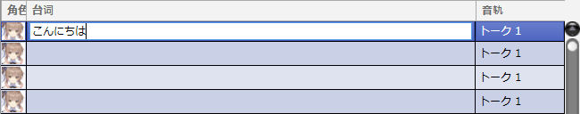

原文：[CeVIO AI ユーザーズガイド ┃ はじめてのトーク作成](https://cevio.jp/guide/cevio_ai/tutorial_talk/)

---

无论是对话，抑或是旁白，都可以利用 CeVIO 创作出适合的声音。

轻轻一点就可以使用诸如「元気一杯」「哀しげ」等预设好的感情[^1]，并更进一步地调整音量和语速等细节。

## 1.启动应用

启动软件后，音轨将在页面的上方显示。

如果有多个音轨，点击写着「语音 1」的音轨（或者时间轴），页面的下方将会出现语音编辑界面。

\* 右键单击右侧角色的图像开启「扩大显示」，可以将图像垂直扩大显示。

## 2.输入台词

在语音编辑界面里选择一行，然后单击该行并输入文字。

## 3.选择角色

拥有多个可使用的角色时，可以在配音角色栏选择说出这一行台词的角色。

## 4.感情的设置

轻轻一点语音编辑界面右侧的预设就能设置角色的感情。

也可以使用感情控制（条形图的推子）来混合多种感情。

## 5.试听

按下试听按钮可以试听选中的台词。

## 6.台词的发声时间

在时间轴上，会显示代表输入的台词的元素（方块）。

拖动（鼠标左键按住并移动）元素来更改发声的时间。

按下播放按钮，可以试听应用了全部轨道的时间的声音。

## 7.导出声音文件

通过菜单的「文件」→「导出」→「导出WAV音频文件」，可以将全部音轨合并，导出为一个立体声 WAV 文件（48kHz 16bit）。

另外，也可以通过「导出语音部分为WAV文件」，将每句台词以单声道 WAV 的格式分别导出（可以在[选项](../option/index.md)中指定采样率和位深度。）。

[^1]: 译者注：这两个都是莎莎拉的感情预设名，分别是「元気」拉满和「哀しみ」拉满
