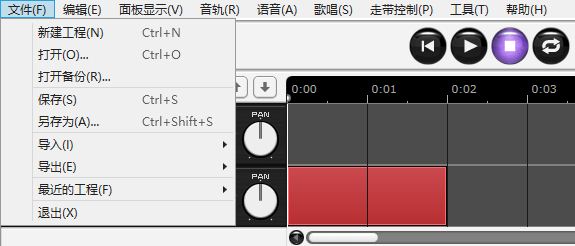

原文：[CeVIO AI ユーザーズガイド ┃ メニュー](https://cevio.jp/guide/cevio_ai/operation/menu/)

---

!!! hint
    如果你不理解菜单里的某个选项是做什么用的，试试将鼠标长时间停留在那个选项上。

## 文件

*ファイル / File*

### 新建工程

*新規プロジェクト / New Project*

创建一个新项目（包括语音和歌唱）。

如果有正在编辑的内容，会显示保存确认画面。

### 打开

*開く/ Open*

打开保存的项目文件。

如果有正在编辑的内容，会显示保存确认画面。

### 打开备份

*バックアップを開く / Open Backup*

打开项目的备份。

备份文件每隔 5 分钟自动保存一次，一周后自动删除。

### 保存

*保存 / Save*

保存正在编辑的项目。

### 另存为

*名前を付けて保存 / Save As*

命名并保存正在编辑的项目。

输入一个文件名，然后点击【保存】。

保存的文件后缀是“ccs”。

### 导入

*インポート / Import*

#### 导入台词文本

*セリフのテキストの読み込み / Text File*

将文本文件的台词导入语音轨道。

[台词的导入](../../talktrack/talk_04)

#### 从青空文库导入

*青空文庫の読み込み / AozoraBunko File*

将青空文库的台词文件，除注释 [#...] 以外的文本导入语音轨道。

#### 导入字幕文件

*字幕の読み込み / Subtitle File*

将 SubRip (.srt) 和 SubViewer (.sbv) 格式的字幕文件导入语音轨道。

#### 导入MIDI音轨

*MIDIの読み込み / MIDI File*

将标准 MIDI 文件导入歌曲轨道。

#### 导入MusicXML

*MusicXMLの読み込み / MusicXML File*

将 MusicXML 文件导入歌曲轨道。

[MIDI／MusicXML的导入](../../songtrack/fileimport)

#### 导入音频文件

*オーディオファイルの読み込み / Audio File*

将外部音频文件加载到以当前光标位置为起点的音频轨道上。

[关于音频文件的格式](../../songtrack/audio)

#### 导入音轨单位文件

*トラック単位の読み込み / Track File*

加载在「导出音轨单位文件」中保存的文件。

#### 导入设置

*設定の読み込み / Settings File*

加载已保存的环境设定。

可选的导入选项有「常规设置」「用户词典」「预置」「台词片段」。

「用户词典」「预置」「台词片段」可以选择「替换现有内容」或「在现有内容的基础上添加」的导入选项。

### 导出

*エクスポート / Export*

#### 导出WAV音频文件

*ミックスダウンWAV書き出し / Audio Mixdown*

将全部轨道导出为一个 WAV 格式（48kHz 16bit 立体声）的文件。

#### 导出语音部分为WAV文件

*セリフの連続WAV書き出し / Audio Files per Each Line*

将所选语音轨道以 WAV 格式（48kHz 16bit 单声道）导出每一行的内容。

* 如果在「详细」中关闭了「按音轨建立文件夹，按序号命名文件」，文件就不会被划分到文件夹中，文件名号就变成了所有轨道中所有行的序列号。

#### 导出台词文本

*セリフのテキスト書き出し / Text File*

将所选语音轨道以用逗号分隔的文本格式导出每一行的内容。

#### 导出字幕

*字幕テキストの書き出し / Subtitle File*

将所选语音轨道以 SubRip (.srt) 和 SubViewer (.sbv) 格式导出每一行的内容。可以用于 YouTube 的字幕。

#### 导出歌唱部分为WAV文件

*ソングのWAV書き出し / Audio File of Song*

将所选歌唱轨道以 WAV 格式（48kHz 16bit 单声道）导出。

#### 导出MIDI

*MIDIの書き出し / MIDI File*

将所选歌唱轨道导出为 MIDI 文件。

* 即使选择了多个音轨，它们也会被合并到一个文件中，而调号会反映在由选定的第一个音轨生成的「Conductor Track」中。

#### 导出MusicXML

*MusicXMLの書き出し / MusicXML File*

将所选歌唱轨道导出为 MusicXML 文件。

#### 导出音轨单位文件

*トラック単位の保存 / Track File*

保存对所选轨道进行的编辑。

保存的文件可以导入到另一个项目并重新使用。

保存文件的后缀是“ccst”。

#### 导出设置

*設定の書き出し / Settings File*

导出当前的环境配置文件。

可选的导出选项有「常规设置」「用户词典」「预置」「台词片段」。

保存文件的后缀是“ccsa”。

### 最近的工程

*最近使ったプロジェクト / Recent Project*

可以选择最近使用的工程并打开。

### 退出

*終了 / Quit*

关闭程序。

如果有正在编辑的内容，会显示保存确认画面。

## 编辑

*編集 / Edit*

### 撤销

*元に戻す / Undo*

回退到之前的工作状态。

### 重做

*やり直し / Redo*

回退到执行「撤销」前的工作状态。

### 剪切

*切り取り / Cut*

切取选择的台词或音符。

### 复制

*コピー / Copy*

复制选择的台词或音符。

### 粘贴

*貼り付け / Paste*

在光标当前的位置粘贴复制（剪切）的台词或音符。

### 删除

*削除 / Delete*

删除选择的台词或音符。

### 全选

*すべて選択 / Select All*

选择当前轨道的所有台词或音符。

## 面板显示

*表示 / View*

### 标准

*標準 / Normal*

默认的显示。

### 全屏

*全画面 / Full Screen*

隐藏窗口标题和菜单，使编辑屏幕更宽。

* 若要退出全屏，请按 ++F11++。

### 封面

*コンパクト / Portrait*

只显示角色图。这种显示方式适用于外部调用等。

除了播放/停止，移动位置光标的快捷键在封面显示模式中也有效。

在封面显示模式中，你可以通过右键点击切换到「始终置顶」。

## 音轨

*トラック / Track*

### 添加音轨

*トラックを追加 / Add Track*

在当前所选音轨下面添加一个新的音轨。

最多可以创建 32 个语音轨道、歌唱轨道和音频轨道。

### 复制音轨

*トラックを複製 / Duplicate Track*

将当前所选音轨复制为一个新轨道。

### 删除音轨

*トラックを削除 / Remove Track*

删除当前所选音轨。

### 上移音轨

*トラックを上に移動 / Move Track Up*

将当前所选音轨向上移动 1 个轨道。

### 下移音轨

*トラックを下に移動 / Move Track Down*

将当前所选音轨向下移动 1 个轨道。

### 清空音轨的内容

*トラック内容をクリア / Clear Track Contents*

将当前所选音轨的内容全部清除。

### 设置音轨的内容为等间隔排列

*トラック内容を等間隔に整列 / Align Track Element*

将当前所选音轨的元素（台词和外部音频）以相等的间隔放置。

### 冻结音轨

*トラックを固定 / Freeze Track*

将当前所选音轨的音频输出到一个文件中，减少播放延迟和多个音轨的混合时间。它还能在播放过程中减少 CPU 和内存的负荷，这在音轨过多导致声音中断或内存不足时很有用。

* 编辑轨道的内容时将会自动解冻。

### 使音轨静音

*トラックをミュート / Mute Track*

静音当前音轨。

### 使音轨独奏

*トラックをソロ / Solo Track*

只播放当前音轨的声音。

### 音轨配音角色

*トラックのキャスト / Cast*

更改当前语音轨道或歌唱轨道的角色。

## 语音

*トーク / Talk*

### 注册单词

*単語の登録 / Japanese Word Registration*

将读错的单词的读音和重音登记到词典中。

### 词典管理

*辞書の管理 / Japanese Dictionary Management*

可以浏览已注册的单词，并对其进行编辑或删除。

### 浏览台词片段

*セリフクリップ一覧 / Speech Clips*

可以浏览已注册的台词，并将其插入到选定的行中，或从列表中删除。

### 搜索

*検索 / Find Text*

通过关键词搜索台词。这在台词行数很多的时候很有用。

### 长段文本输入

*文のまとめ入力 / Enter Text Collectively*

对于那种一口气输入到一行里十分费时费力的长句子，可以用这个功能一次性输入。

也可以当台词分割功能使用。

### 连续输入台词

*連続でセリフ入力 / Continuous Input*

开启该选项时，将会启用下列功能以辅助台词的连续输入。

* 按 ++enter++ 键结束这一行的编辑，自动移至下一行并进入编辑状态。

* 按 ++shift+enter++ 键结束这一行的编辑，自动移至上一行并进入编辑状态。

* 按 ++ctrl+enter++ 键结束这一行的编辑，按 ++esc++ 键撤销编辑，在空白行按 ++enter++ 键结束编辑。

### 自动排列台词

*セリフの自動整列 / Automatic Line Alignment*

开启该选项时，输入台词后后续的台词会自动前后移动（以维持间距）。

关闭该选项时，台词的编辑与移动不会改变其他台词的位置。

### 添加空白行

*空白行の追加 / Add Blank Line*

在台词列表末尾添加 10 行空白行。

### 音素图

*音素グラフ / Phoneme Graph*

#### 调整模式

*調整モード / Edit Mode*

在语调 / 音高 / 音量三个调整模式间切换。

#### 显示调整线

*長さのラインを重ねて表示 / Overlay Duration Lines*

关闭该选项时，音长调节的调整线将隐藏。

* 音长依然可以通过拖拽音素图上下的文本区域来调整，上下滚动鼠标滚轮也可以。

#### 按音素单位调整

*音素単位で調整 / Phoneme Mode*

开启该选项时，可以对音素单位做更细致的调整。

* 即使关闭该选项，也可以按 ++alt++ 暂时切换到以音素为单位显示音素图，然后用鼠标拖动来调整音素单位。

#### 恢复默认设置

*初期値に戻す / Reset*

将音素图当前调整模式下的所有长条柱恢复到调整前的状态。

### 音素图显示

*音素グラフの配置 / Placement of Phoneme Graph*

变更音素图的显示位置。也可以选择隐藏。

### 显示别的音轨的台词

*別トラックのセリフを表示 / Other Track Lines*

选择是否要在台词列表里显示所有语音轨道的台词。

### 选择列

*列の表示 / Column*

修改台词列表里信息列的显示状态。

## 歌唱

*ソング / Song*

### 选择 / 范围选择 / 画笔 / 直线 / 橡皮擦工具

*選択／まとめ選択／ペン／ライン／消しゴムツール*

*Selection / Collectively Selection / Draw / Line / Eraser Tool*

切换编辑工具。

[编辑工具](../edittool)

### 量化

*クオンタイズ / Quantize*

变更量化。

[量化是](../infopanel#音符量化)

### 参数调整

*調整モード / Edit Mode*

在用于输入音符和歌词的乐谱编辑模式和调整时间、音量、音高和颤音的模式间切换。

也可以禁用所选音轨的颤音。

### 输入歌词

*歌詞のまとめ入力 / enter Lyrics Collectively*

一次性从当前选中的音符开始（若未选定的话则从头开始）插入歌词。

### 按音素输入歌词

*音素で歌詞入力 / enter Lyrics with Phoneme*

按音素记号（发音记号）输入歌词。

开启该选项时，输入模式切换为音素输入模式，歌词输入栏的背景会变为蓝灰色。

### 消除短空白

*細かい空白の除去 / Remove Fine Spaces*

删除 MIDI 文件导入等原因导致的小空隙（休止符）。

### 插入小节

*小節の挿入 / Insert Measures*

在指定的位置往所选音轨或全部音轨中插入小节。

也可以通过按住钢琴卷帘底部的滚动条的向右滚动按钮，或通过 ++shift++ + 下鼠标滚轮的方式往末尾追加小节。

### 删除小节

*小節の削除 / Delete Measures*

在指定的位置往所选音轨或全部音轨中删除小节。

### 显示其他音轨的音符

*別トラックの音符表示 / Other Track Notes*

选择是否要在乐谱编辑页面里显示所有歌唱轨道的音符。

### 显示标尺

*ルーラー表示 / Ruler View*

修改曲速、拍子、调号、强弱记号的显示与否。

### 显示网格线

*ライン表示 / Line View*

修改钢琴卷帘内拍子线、量化线的显示与否。

开启「在调整界面也显示网格线」时，调整界面中也会显示网格线。

### 光标指示器

*ガイドカーソル / Guide Cursor*

修改标尺栏内当前鼠标对应量化位置的显示与否。

* 使用范围选择工具 / 画笔工具 / 直线工具时，该量化位置也会出现在乐谱编辑页面中。

## 走带控制

*トランスポート / Transport*

### 播放/停止

*再生／停止 / Start/Stop*

从光标的位置开始播放。

### 停止

*停止 / Stop*

停止播放。停止状态下再次点击会依次回到播放开始位置、歌曲开头。

### 停止时返回开始播放位置

*停止時に開始位置に戻る / Return to Start Position when Stopped*

停止播放时光标返回到播放开始的位置。

### 播放时自动滚动

*再生中の自動スクロール / Auto scroll*

在播放时自动滚动时间轴 / 台词列表 / 钢琴卷帘。

关闭该选项时，将启用手动滚动。该选项能在播放时修改。

### 循环

*繰り返し / Circle*

开启 / 关闭播放的循环设置。

### 起点标记

*始点マーカー / Start Marker*

设置 / 撤除循环的起点。

### 终点标记

*終点マーカー / End Marker*

设置 / 撤除循环的终点。

### 返回开头

*先頭へ移動 / Goto Zero*

使光标移动到开头。

### 移动到起点标记

*始点マーカーへ移動 / Goto Start Marker*

使光标移动到起点标记所在的位置。

### 移动到终点标记

*終点マーカーへ移動 / Goto End Marker*

使光标移动到终点标记所在的位置。

### 移动到选择要素

*選択要素へ移動 / Goto Selected Element*

使光标移动到当前选定台词 / 外部音频的左端。

### 向指定位置移动

*指定位置へ移動 / Goto Time*

使光标移动到指定位置。

可以以「分：秒」或「小节：拍子」的方式输入位置。

### 显示光标

*カーソルへ移動 / Goto Cursor*

显示光标所在的位置。

当找不到画面外的光标位置时很有用。

### 时间基准

*タイムベース / Timebase*

将工具栏 / 时间轴的时间切换为以秒 / 小节为显示单位。

### 走带控制器上下位置

*上下の表示位置 / Vertical Location*

将走带控制器的位置设置为上部 / 中部 / 下部。

### 走带控制器左右位置

*左右の表示位置 / Horizontal Location*

将走带控制器的位置设置为左侧 / 中间 / 右侧。

## 工具

*ツール / Tool*

### 选项

*オプション / Options*

可以改变环境设置，比如角色显示，语音 / 歌唱的各种设置。

[选项](../../option/option)

## 帮助

*ヘルプ / Help*

### 显示联机帮助

*ヘルプの表示 / User Manual*

在浏览器中打开本用户指南。必须连接到网络。

### CeVIO官方网站

*CeVIOオフィシャルサイト / CeVIO Official Website*

在浏览器打开 CeVIO 的官方网站。必须连接到网络。

### 检查更新

*アップデートを確認 / Check for Update*

检查是否有较新的版本。必须连接到网络。

### 序列号认证

*製品を購入 / Activate Product License*

在这里输入序列号以激活许可证。必须连接到网络。

也可以在这里确认已激活的产品和它们的序列号。

### 版本信息

*バージョン情報 / About CeVIO AI*

确认本软件的版本、声库、声音合成引擎的信息。

--8<-- "includes/abbreviations.md"
