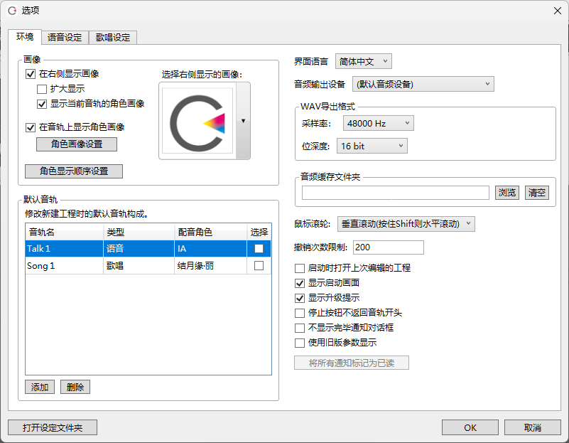
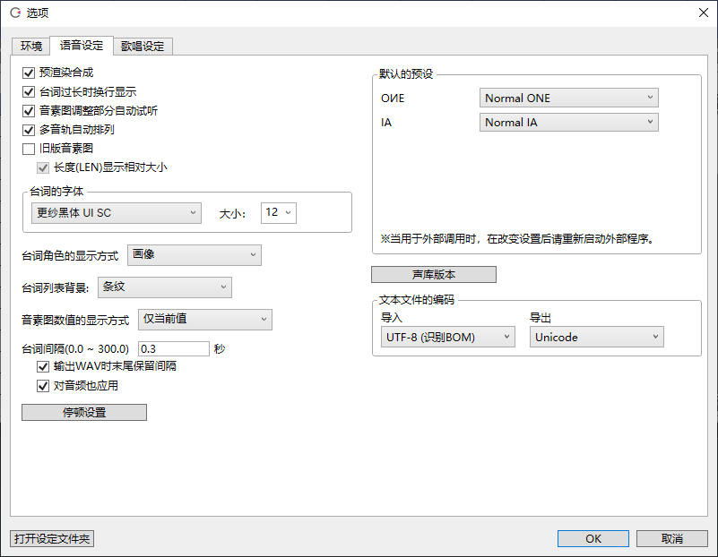
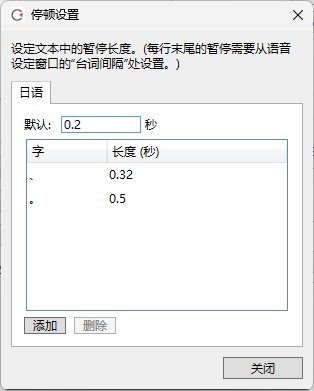
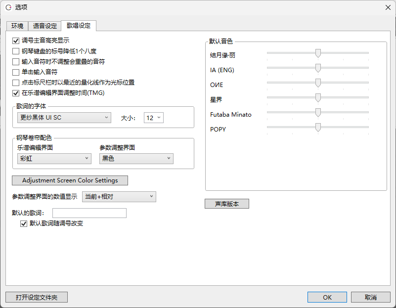

原文：[CeVIO AI ユーザーズガイド ┃ オプション](https://cevio.jp/guide/cevio_ai/option/)

---
!!! tip
    如果你不理解某个选项是做什么用的，试试将鼠标长时间停留在那个选项上。

「工具」菜单里的「选项」可以修改各种设定。

## 环境

### 画像

#### 在音轨上显示角色画像

选择是否要在音轨上显示角色的图片。

#### 角色画像设置

修改各个角色的显示画像。可以用用户画像替换。

※该例中用すずきつづみ（铃木梓梓弥）的用户图像替换掉了角色「OИE」的语音声库的图像。

[显示自定义图像](../characterimage)

#### 在右侧显示画像

开启后，主屏幕右上方会显示角色的图像。

##### 扩大显示

开启后，画像会扩展到窗口的顶部和底部。

##### 显示当前音轨的角色画像

开启后，角色画像会随着选择的轨道或选择的台词而切换。

#### 选择右侧显示的画像

可以设置显示在屏幕右侧的图像。在图像上单击，从列表中选择一张图片显示。也可以将自己的图片拖放到这里，将它们注册为用户图片并选择。

※开启「显示当前音轨的角色画像」后，「选择右侧显示的画像」将显示未选择轨道时展示的图片。

### 默认音轨

设置新项目的轨道名、类型与角色。

在「选择」栏中选中的轨道将以选定状态启动。

角色列表里最上方的角色将是创建轨道时的默认角色。

### 界面语言

切换菜单等在用户界面显示的语言。

### 音频输出设备

可以在这里选择默认音频设备以外的音频设备。

### 音频导出格式

可以在这里指定导出的 WAV 文件的采样率和比特深度。

※比特深度越高，音质越好。以 96kHz 采样率输出的音质与 48kHz 没有区别。

※目前，「导出WAV音频文件」输出的音频格式固定为 48kHz 16bit。

### 音频缓存文件夹

设置文件夹，用于存放冻结音轨或加载外部音频文件时生成的缓存文件。

缓存文件不会自动删除。要减少硬盘空间使用量，请使用「清空」按钮清理它们。

### 鼠标滚轮

修改时间轴等的默认滚动方向（垂直 / 水平）。

### 撤销次数限制

最大可以设置为 100000。

※次数越多，耗费的内存也越高。

### 启动时打开上次的工程

启动时自动打开上次关闭软件时编辑的工程，并恢复到之前的编辑状态。

### 显示启动画面

关闭后，启动时就不会显示 CeVIO 的闪屏，在启动 CeVIO 时就可以去操作别的软件。

### 显示升级提示

例如为了与其他软件协作，或是想要保持特定的版本，请关闭该选项。

### 停止按钮不返回音轨开头

停止时连续按下停止按钮（或 ++num0++），选择让光标返回音轨的开头，或是仅停留在播放开始的位置。

### 不显示完毕通知对话框

WAV 导出结束后或文本导入完毕后，不显示完成的通知对话框。

### 使用旧版参数显示

音量、语速、感情等参数用 0~100 的数值显示（CeVIO Creative Studio 风格）。

### 将所有通知标记为已读

将启动时显示的通知全部标记为已读。在换 PC 或者纯不想看广告时很方便。

## 语音设定

### 预渲染合成

在播放开始前合成声音，避免播放中的跳音或突然停顿。

如果台词有很多行，第一次播放时需要更长的时间，但之后就只有编辑过的行会重新合成。这大大提高了合成速度。

若关闭该选项，则仅在播放时进行合成。

### 台词过长时换行显示

台词列表中，长文的右端会换行，以显示整句台词。

### 音素图调整部分自动试听

音素图将从调整点的前一个停顿处（如标点符号）开始自动播放，直到遇到调整点的后一个停顿处。

### 多音轨自动排列

从「语音」菜单或右键菜单的「台词的自动排列」开启自动排列时，来自显示别的音轨的台词会自动前后移动以避免重叠。

开启「音频自动排列」时，音频元素也会自动前后移动以避免重叠。

如果同时开启本设置和「音轨」菜单里的「设置音轨的内容为等间隔排列」，调整时其他轨道也会一并包括在内。如果不想移动台词（让它们重叠），请关闭该选项。

### 旧版音素图

水平轴是等距的，垂直轴用于长度调节，长度调节最长可以达到 1 秒。

※格式与『CeVIO Creative Studio』版本 5.2 相同。

#### 长度（LEN）显示相对大小

旧式音素图里 LEN 值越小，显示的时间越长。关闭时，垂直轴是等距的。

### 台词的字体

指定台词列表的字体和大小。

### 台词角色的显示方式

从画像、名字、画像+名字里选择一种作为台词列表左端的角色显示方式。

### 台词列表的背景

从 5 种背景中选择一种作为台词列表的背景。

- 条纹
- 浅蓝色
- 深蓝色
- 白色
- 黑色

### 音素图数值的显示方式

选择当鼠标光标悬停在音素图上时显示的数值。

### 台词间隔

指定输入台词或排列台词时台词间的间隔。

#### 输出WAV时末尾保留间隔

导出时台词末尾会保留同样长度的静音时间。

#### 对音频也应用

应用「设置音轨的内容为等间隔排列」或开启「音频自动排列」并编辑时，音频元素会自动保持间隔。若再与「多音轨自动排列」相结合，便能更容易地创建与其他语音合成软件的对话。

### 停顿设置

分别设置句読点或記号等符号的停顿时长。

※也可以把全角空格设置为最短的 0.025 秒，然后输入「みなさん　こんにちは」这样的台词来分割重音短语。

※当句子中有一连串诸如「・・・」的停顿字符时，停顿的长度会反映在停顿字符的数量上。

※要将 WAV 末尾的无声段长度设置为零，请关闭「输出WAV时末尾保留间隔」。

### 默认的预设

指定新建音轨，更改角色或外部调用时的预设。

当用于外部调用时，在改变设置后请重新启动外部程序。

!!! tip "外部调用时的默认预设"
    在 SAPI5 中，「语速」由链接方的设置决定，「音量」和「音高」由链接方和本软件的设置共同决定，其他设置由本软件决定。如果连接到 SAPI5 时声音很小，请试着将预设的音量调到 +8.00 / 100。

    在 COM 组件 / .NET 程序集中，状态和感情为默认值。

    ※如果所有的参数由链接的应用程序控制，则不使用这些设置。

### 声库版本

一些角色可以选择声库的版本。

### 文本文件的编码

指定读取文件和导出文件时的编码。

请根据需要修改编码，以配合读取或导出文本文件的外部软件。

## 歌唱设定

### 调号主音高亮显示

在乐谱编辑页面高亮显示当前调号的主音。

### 钢琴键盘的标号降低1个八度

将 440Hz 的音用钢琴卷帘键盘上的 A3（原为 A4）表示。

### 自动分割英语歌词的音节

输入英语歌词时，按 1 音符 1 音节的方式分割单词并分配给音符。

※由于是自动推算，可能会有出错的情况。

### 输入音符时不调整会重叠的音符

输入音符时，不删除已输入的音符，即使会导致重叠。

### 单击输入音符

启用类似 DAW 的操作，单击就能直接输入音符，无需拖动。

启用该设定时，仍然可以通过拖动来指定长度。不拖动时，长度会被量化。

### 点击标尺栏时以最近的量化线作为光标位置

因为光标移动到了更左或右的位置，这个功能让钢琴卷帘标尺栏的量化更接近 DAW 的操作。

### 在乐谱编辑页面调整时间（TMG）

在乐谱编辑页面的下方可以对时间做简单的确认和调整。

### 歌词的字体

指定歌词的字体和大小。

### 钢琴卷帘配色

对于钢琴卷帘的背景，从 6 种背景中选择一种作为乐谱编辑页面的背景：

- 彩虹
- 蜡笔
- 简约
- 蓝色
- 灰色
- 黑色

从 2 种背景中选择一种作为调整页面的背景：

- 灰色
- 黑色

### 参数调整界面的数值显示

选择在调整界面里，当鼠标光标悬停在参数上时显示的数值。

### 默认的歌词

修改输入音符时的默认歌词，比如改成「ら」。

留空则为默认根据音阶分配的「ドレミファソラシ」（Do Re Mi Fa So La Ti）。

#### 默认歌词随调号改变

「默认的歌词」留空时，取消勾选将把「ドレミ……」固定为 C Major。

### 默认音色

指定新建音轨或更改角色时音色初始值。

### 声库版本

一些角色可以选择声库的版本。

!!! info "关于设定文件夹"

    文件夹内存储了下列配置文件（除了选项设置，它是在使用该功能时生成的）。

    - TalkDictionary3.dic（用户字典）
    - PhraseClips.xml（台词片段）
    - Personality.xml（预设）
    - RuntimeSettings.xml（选项设置）

    如果你想把设置转移到另一台电脑上，请从菜单中选择「文件」→「导出」→「导出设置」，然后从另一台电脑上的「文件」→「导入」→「导入设置」中导入。
