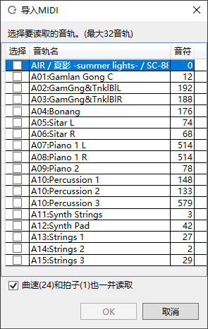

原文：[CeVIO AI ユーザーズガイド ┃ MIDI／MusicXML](https://cevio.jp/guide/cevio_ai/songtrack/fileimport/)

---

## 导入 MIDI 文件

可以导入由外部软件创建的 MIDI 文件。

在「文件」菜单的「导入」下选择「导入MIDI音轨」，并指定 MIDI 文件。

也可以从资源管理器中拖放 MIDI 文件到歌曲轨道上。

接下来将显示 MIDI 文件的音轨结构，选择要导入的音轨并按 OK 键。

※最多可以加载八个音轨。

※如果勾选「曲速和拍子也一并读取」，在 MIDI 文件中设置的曲速和拍子将反映在所有歌唱轨道中。

!!! tip "纠正 MIDI 文件"
    导入 MIDI 文件时，太细的音符（短于 32 分的音符）的位置和长度会被自动纠正。

    与其在音符之间留下细小的空隙，不如按照原样写谱，这样能唱出更自然的歌声。

    请将促音包含在歌词中，在音符下方或时间调整页面调整发声的时机。

## 导出 MIDI 文件

可以导出 MIDI 文件，以便与兼容的外部软件一起使用。

时间轴右键菜单中的「导出」可以轻松地导出单个选定的轨道。

「文件」菜单中的「导出」，可以将多个音轨合并到一个文件中一起导出。

※选择多个音轨时，调号会反映在由选定的第一个音轨生成的「Conductor Track」中。

※时间和音高等调整值不会导出。

## 导入 MusicXML 文件

可以导入由外部软件创建的 MusicXML 文件。

在「文件」菜单的「导入」下选择「导入MusicXML」，并指定 MusicXML 文件。

也可以从资源管理器中拖放 MusicXML 文件到歌曲轨道上。

若 MusicXML 包含多个音轨，则只会加载第一个音轨。

## 导出 MusicXML 文件

可以导出 MusicXML 文件，以便与兼容的外部软件一起使用。

时间轴右键菜单中的「导出」可以轻松地导出单个选定的轨道。

「文件」菜单中的「导出」，可以将多个音轨合并到一个文件中一起导出。

※时间和音高等调整值不会导出。

!!! info "关于文字编码"

    MIDI 文件可以用「Shift-JIS」读取/写入；MusicXML 文件可以用「UTF-8」读取/写入。
