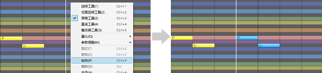
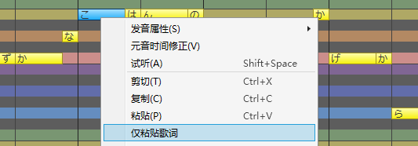

原文：[CeVIO AI ユーザーズガイド ┃ 音符の入力と編集](https://cevio.jp/guide/cevio_ai/songtrack/song_02/)

---

可以使用调整工具在「乐谱编辑」的状态下输入和编辑音符。

## 输入音符

若要输入音符，请从编辑工具里选择画笔工具。

在钢琴卷帘上，从放置音符的地方左右拖拽（按住鼠标左键并移动）来决定音符的长度。

在执行音符的输入、移动或粘贴的操作时，若音符与同一轨道的其他音符重叠，则其他音符会自动缩短。（可选项。可以在选项中选择「输入音符时不调整会重叠的音符」。）

最开始的小节（第 0 小节）不允许输入音符。

输入音符后，它的下方会显示歌词的音素和发声时间。可以在这里调整时间。

在键盘上单击，该轨道的角色会唱出当前音阶上的这个音。

!!! tip "音符输入的提示"

    不推荐用音符和音符间细小的空隙表示促音（っ），或用诸如 1/32 等细小的音符位置来表达发声的时机。

    将促音包含在歌词中，在音符下方或时间调整页面调整发声的时机，会得到更好的歌声。

## 删除音符

从编辑工具里选择橡皮擦工具，再单击音符，便可擦除音符。

另外，使用橡皮擦工具以外的工具时，选中音符再按 ++del++ 键也可以删除音符。

## 调整音符长度

从编辑工具里选择选择工具或画笔工具，再拖拽音符的左侧或右侧，便可调整音符长度。

## 移动音符

从编辑工具里选择选择工具或画笔工具，再拖拽音符，便可移动音符。

拖拽时按住 ++shift++ 键，可以水平或垂直移动音符。

同时选中多个音符时可以一并移动它们。

另外，拖拽时按住 ++alt++ 键可以复制选择的音符。

※不允许将音符移至第 0 小节。

### 连同音符的参数一并移动

选中音符后，用鼠标拖拽或用 ++up++ 或 ++down++ 键移动它，则音高会自动随之变换。

使用[范围选择工具](../song_05)圈定范围，然后移动它们，则选择范围内的音符会连同它们的参数一并移动。

!!! tip "自动范围选择与回避方法"

    若移动的音符是已经调整过参数的音符，则它们会自动被范围选中并连带参数一起移动，即使移动它们的工具并不是范围选择工具。这时只要按住 ++alt++ 键再垂直移动，它们就不会被范围选择，它们的参数也就会留在原地。

## 复制与粘贴音符

从编辑工具中选择选择工具或画笔工具，然后点击待复制的音符。

可以通过按住 ++rctrl++ 或 ++shift++ 键并点击音符来选择多个音符。

也可以在使用选择工具的情况下，通过在钢琴卷帘上拖动，来选择拖动范围内的音符。

选定音符后，从右键菜单中选择「复制」。

然后，从右键菜单中选择「粘贴」，将音符粘贴在光标位置。

### 连同音符的参数一并复制与粘贴

使用[范围选择工具](../song_05)圈定范围后复制，可以一并复制范围内的音符调整值、节拍、强弱记号等参数。之后，利用光标指定位置并粘贴，便可轻松地再现原始的音符和调整值。

### 只粘贴歌词

复制音符后，在想要粘贴歌词的音符上调出鼠标右键菜单，然后选择「只粘贴歌词」。

歌词将反映在相对开始时间与复制源一致的音符上。请活用该功能，例如，使用该功能来创建合唱轨道。

## 简易 TIMING 显示

※关闭「选项」中的「歌唱设定」下的「在乐谱编辑页面调整时间（TMG）」可以隐藏 TMG 线。

### 简易 TIMING 调整

切换到画笔工具时，将鼠标移到黑带上就可以看到辅音与元音的 TMG 线；向左或右拖动以调整发声时机。

默认以音符为单位调整。按下 ++ctrl+p++ 或在歌唱菜单栏里选择「以音素输入歌词」，可以将 TMG 的单位切换为音素。按住 ++alt++ 键可以暂时切换。

### 指定音素记号

双击 TMG 显示的音素符号可以编辑音素。

※也可以通过切换到「按音素输入歌词」然后双击音符的方式，或通过音符属性来编辑音素。
