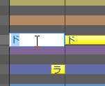
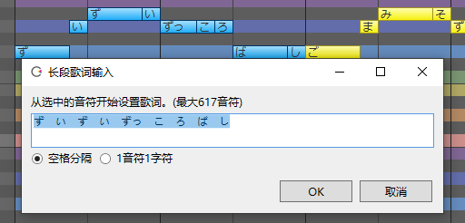
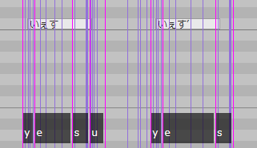
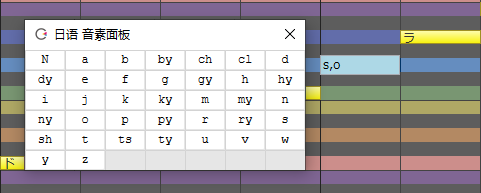
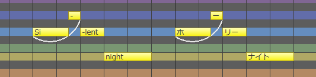

原文：[CeVIO AI ユーザーズガイド ┃ 歌詞の入力（日本語ボイス）](https://cevio.jp/guide/cevio_ai/songtrack/song_04/)

---

歌词中的音符默认是根据音阶分配的「ドレミファソラシ」（Do Re Mi Fa So La Ti）。

（可以通过选项的「歌唱设置」的「默认歌词」修改默认歌词，比如改成「ら」。）

可以为每个音符输入歌词，也可以一次性为所有音符输入歌词。

## 输入歌词

在调整工具的「乐谱编辑」里双击一个音符以输入音符。

也可以用 ++f2++ 键进入选定音符的输入状态。在输入状态下输入歌词后，按 ++enter++ 键提交歌词。

在输入歌词后如果按 ++tab++ 键而不是 ++enter++ 键，则可以继续为下一个音符输入歌词。

允许输入全角平假名/片假名和半角英文字符，而且可以为一个音符输入多个字符。

※无法发声的字符以红色显示。 

## 长段歌词输入

可以通过「歌唱」菜单、钢琴卷帘的右键菜单或者快捷键 ++f8++ 快速调出该界面。

选择「按空格分割」时，可以通过输入由空格（空白）分隔的字符来为一个音符指定多个字符。

选择「1音符1音节」时，每个音符会分到一个字母，但如果像「しゃ」这样后面跟着一个小写字母（ぁぃぅぇぉっゃゅょ），则分配两个字母（音拍单位）。

!!! new "改进的「长段歌词输入」"
    （「按空格分割」时）如果只选择了一个音符，所有后续的歌词都会显示出来。

## 元音脱落记号

如果歌词中包含 `’`（全角引号），那么它前面的音拍（假名）中的元音就会脱落，只发辅音的音。

举例来说，输入 `いぇす` 会发「yesu」的音，最后的「す」的音非常明显；但输入 `いぇす’` 就会让元音「u」脱落，从而发出更自然的「yes」的音。

※可以在末尾以外的地方输入 `’`，比如说 `す’ぺーす’`，但实际效果因 `’` 附着的音拍而异。对「あ行」无效。

## 假声记号

如果歌词中包含 `※`，那么该音符将发假声。

但是，受角色和音符音高（比如说音高偏低的音符）的影响，发出的声音可能不是假声。

[其他特殊符号](../song_symbol)

## 输入音素记号

在音素输入模式下，可以用音素单位指定发声。

在输入歌词时，可以通过右键菜单「按音素输入歌词」或快捷键 ++ctrl+p++ 切换到音素输入模式。

在音素输入模式下，歌词输入栏的背景会变为蓝灰色，并在随后的输入中保持这个颜色。

（也可以通过「歌唱」菜单或钢琴卷帘的右键菜单切换到「音素输入模式」。）

音素输入模式下会显示「音素面板」。单击面板上的字符输入音素符号，之后按 ++enter++ 键或关闭音素面板便可提交更改。

音素间使用 1 字符宽的空格 ` ` 或 1 字符宽的 `,` 分割。若音节间有混淆，可以使用 `|` 分割（例如 `y,e,s|a,i`）。

若输入了音素面板上不存在的字符，则该字符将被视作错误的歌词（以红色显示），所在的音符将不会发声。[^1]

## 英语歌词

若以半角英文字符输入了歌词，则日语声库的音素将分配给英语音素以歌唱。英语和日语能在同一首歌中混杂出现。

在选项中打开「自动分割英语歌词的音节」后，英文歌词也会自动按音节分割并分配给音符。

※即使在「连续输入歌词」中选择「以空格划分」，并混合输入日语和英语歌词时，英语音节也可以自动划分。

※英文歌词中输入的假声符号 `※` 会自动转换为英文声库使用的 `$`。

※由于分配的是日语音素，发音会与原始的英语发音有所不同。

[^1]:译者注：从 8.2.8.0 起，在不存在于面板上的音素中，日语声库中大写的日语元音字符 (`A` , `I` , `U` , `E` , `O`) 现作为特例正常播放。详见[更新日志](../../intro/change-log#2022512-8280)。

*[「自动分割英语歌词的音节」]:英語の歌詞を音節で自動分割 / Automatically split English lyrics with syllables
