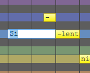
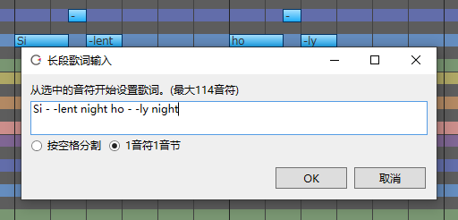
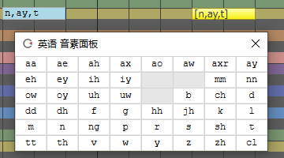

原文：[CeVIO AI ユーザーズガイド ┃ 歌詞の入力（英語ボイス）](https://cevio.jp/guide/cevio_ai/songtrack/song_04english/)

---

使用英语声库时，歌词中的音符默认是根据音阶分配的「Do Re Mi Fa So La Ti」。

（可以通过选项的「歌唱设置」的「默认歌词」修改默认歌词，比如改成「La」。）

可以为每个音符输入歌词，也可以一次性为所有音符输入歌词。

## 输入歌词

在调整工具的「乐谱编辑」里双击一个音符以输入音符。

也可以用 ++f2++ 键进入选定音符的输入状态。在输入状态下输入歌词后，按 ++enter++ 键提交歌词。

在输入歌词后如果按 ++tab++ 键而不是 ++enter++ 键，则可以继续为下一个音符输入歌词。

允许输入半角英文字符、`.`、`'`、`-` 和 `$`（假声记号）。

※无法发声的字符以红色显示。

`-` 可以用来将一个词（及其音素）分成多个音符。

例如，`holy` 可以分为两个音 `ho` 和 `-ly`；`tenderly` 可以分为四个音 `ten`、`-der`、`-ly` 和 `-`。

※只有 `-` 才会延长前面的音素。另外，将 `tenderly` 分为两个音符输入，如 `tenderl` 和 `-y`，会自动分配音素。[^1]

## 长段歌词输入

可以通过「歌唱」菜单、钢琴卷帘的右键菜单或者快捷键 ++f8++ 快速调出该界面。

选择「按空格分割」时，可以通过输入由半角空格分隔的字符，将歌词分配到多个音符上。

选择「1音符1音节」时，由半角空格分割的单词会自动再按音节分割，并为每个音符分配一个音节。

!!! new "Improved "Enter Lyrics Collectively""
    　All subsequent lyrics are displayed if only one note is selected (when Space-Separated).

## 假声记号

如果歌词中包含 `$`，那么该音符将发假声。

※受角色和音符音高（比如说音高偏低的音符）的影响，发出的声音可能不是假声。

## 输入音素记号

在音素输入模式下，可以用音素单位指定发声。

在输入歌词时，可以通过右键菜单「按音素输入歌词」或快捷键 ++ctrl+p++ 切换到音素输入模式。

在音素输入模式下，歌词输入栏的背景会变为蓝灰色，并在随后的输入中保持这个颜色。

（也可以通过「歌唱」菜单或钢琴卷帘的右键菜单切换到「音素输入模式」。）

音素输入模式下会显示「音素面板」。[^2]单击面板上的字符输入音素符号，之后按 ++enter++ 键或关闭音素面板便可提交更改。

音素间使用 1 字符宽的空格 ` ` 或 1 字符宽的 `,` 分割。若音节间有混淆，可以使用 `|` 分割（例如 `y,e,s|a,i`）。

若输入了音素面板上不存在的字符，则该字符将被视作错误的歌词（以红色显示），所在的音符将不会发声。

[^1]:译者注：（如果理解正确的话）具体来说就是，将 `tenderly` 分为 `tenderl` 和 `-y` 时，如果不分割音素，则前一个音符分到的音素是「t,eh,n,d,axr,l」，后一个音符分到的是「iy」。但是，因为音素会自动分割，所以实际上前一个音符分到的音素是「t,eh,n,d,axr」，后一个音符分到的是「l,iy」。另外其实在这个例子里自动分割的音素才是正确的分割，因为 tenderly 这个词的分割点是 ten·der·ly，该断开的位置应该是 ly，发「l,iy」的音。
[^2]:译者注：CeVIO 使用的音素与 IPA 的对照表参见[注册单词与发音记号（英语声库）的“发音记号一览”一节](../../talktrack/talk_01_english/#_8)。
