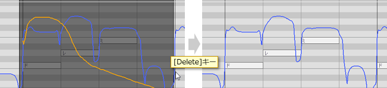
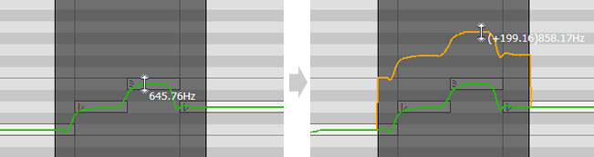
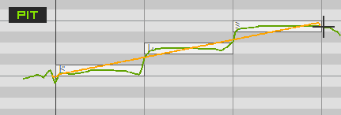
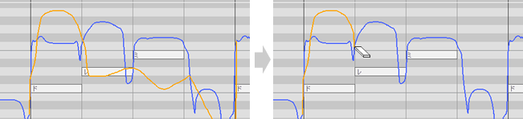

原文：[CeVIO AI ユーザーズガイド ┃ 歌声の調整①（編集ツール）](https://cevio.jp/guide/cevio_ai/songtrack/song_05/)

---

通过工具栏的编辑工具或钢琴卷帘的右键菜单可以切换编辑模式。

按住 ++ctrl++ 键可以临时切换编辑工具。

## 选择工具

*選択ツール / Selection Tool*

拖动（鼠标左键按住并移动）以指定复制或删除的范围。

指定范围后，使用 ++ctrl+c++ 键复制调整屏幕范围内的调整值。复制的内容可以用 ++ctrl+v++ 键粘贴到光标所在的位置。

指定范围后，使用 ++del++ 键会删除范围内的调整值，并将其恢复为原始值。

### 复制和粘贴时间调整值（TMG）

在复制 TMG 时，同时会记录五条音素线其中的特定条。

例如，如果复制第三条线，粘贴时它将粘贴到光标后的第三条线上。

按住 ++alt++ 键时将脱离量化限制，可以指定更细的范围。

### 调整值的上下移动

在时间以外的调整屏幕中，在指定范围后向上或向下拖动参数值，可以使范围内的数值按原样向上或向下移动。当整体增加或减少某一范围内的颤音时很有用。

按住 ++alt++ 键时将脱离量化限制。

### 乐谱编辑页面

选中音符后（使用选择工具或范围选择工具），用鼠标拖拽或用 ++up++ 或 ++down++ 键移动它，则音高调整值会自动随之变换。

## 范围选择工具

*まとめ選択ツール / Collectively Selection Tool*

圈定范围后复制，可以一并复制范围内的音符调整值、节拍、强弱等参数。之后，利用光标指定位置并粘贴，便可简单地再现原始的音符和调整值。

### 以小节为单位粘贴

如果选择了一个小节并用光标粘贴到最开始的第 0 小节处，则它将以「以小节为单位粘贴」的方式粘贴，除了本就会粘贴的曲速和强弱符号外，拍子和调号也会一并粘贴。如果被粘贴的小节的节拍与被粘贴的小节不同，小节将被扩展或缩减。[^1]

※例如，如果复制了一个 4/4 拍的小节，然后粘贴到一个 3/4 拍的小节中，它将自动多添加一拍。

※当复制的单位不是小节，或当光标位置不在最开始的第 0 小节时，将不会发生拍子和调号的粘贴以及小节的扩展/缩减。

### 曲速·拍子的变化

所有歌唱轨道共享曲速和拍子的设定。所以如果在范围选择后通过删除/剪切/粘贴改变了曲速或节拍，项目中的所有歌唱轨道都会受到影响。

### 乐谱编辑屏幕

在乐谱编辑画面，圈定范围后拖动，选择范围内的音符会连同它们的参数一并移动。

※拖拽时按住 ++shift++ 键，可以水平或垂直移动音符。

## 画笔工具

*ペンツール / Draw Tool*

拖动以调整参数。调整后的数值显示为橙色。

※在重叠显示和连接调整时，只显示有效的数值（已调整部分为调整后的值）。

### 连续调整模式

在调整音高、音量或颤音时，拖动时按住 ++alt++ 键，可以画出一条与原始值整齐连接的线。

* 按住 ++alt++ 并拖动鼠标时，画笔工具将会画出红色的调整线。此时放开 ++alt++ 键时，画出的红线和原始的参数线将会自动连接，并以此作为新的参数。
* 按住 ++alt++ 键，会出现一条参考线，它反映的是已调整的参数值。可以依此确认当前的状态。
    
    ※如果在画线前就放开了 ++alt++ 键，则焦点会切到菜单上[^2]，但可以通过长按 ++alt++ 键的方式再次确认。

## 直线工具

*ラインツール / Line Tool*

拖动以画出一条直线。

拖动的同时按下 ++shift++ 键可以画出水平线。

注意，在时间调整页面不能画线，此时它的工作方式与画笔工具相同。

## 橡皮擦工具

*消しゴムツール / Eraser Tool*

拖动以删除调整值，返回到原始值。

在音高 / 颤音调整页面拖动的同时按住 ++shift++ 键时可以删除原始值。[^3]

[^1]:译者注：可以试试在标尺栏上随便设点数值，然后用范围选择工具在钢琴卷帘里拖动一下，观察拖满一个小节时四个标签的颜色变化。
[^2]:译者注：这个其实是 Windows 系统使用键盘调用菜单的快捷键，菜单的文字里后面跟着的字母就是调用它们的键。比如说你现在试试看在 CeVIO 里按 ++alt++ 再按一下 ++f++（
[^3]:译者注：算是个小技巧，用橡皮擦删掉原始音高值可以做出黑嗓。
