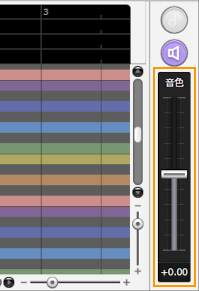
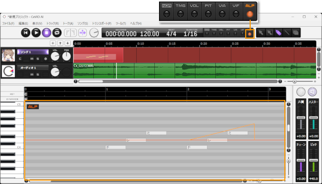

原文：[CeVIO AI ユーザーズガイド ┃ 歌声の調整③（声質）](https://cevio.jp/guide/cevio_ai/songtrack/song_06/)

---

通过调整音色，可以把声音变成更像大人或更像孩子的歌声。

拖动（按住鼠标左键并移动）音色滑块（推子）来改变选定轨道的音色。

也可以把鼠标光标悬停在滑块上，通过向上或向下移动鼠标滚轮来调整它。

※声音变化的程度因角色而异，例如「可不(KAFU)」的变化就比较小。

## 音色的详细调整

通过工具栏上的「ALP」按钮或菜单切换到调整屏幕，可以对音色进行微调（最小单位为 5 毫秒）。

调整是相对于整个音轨的音色而言的，当向上或向下移动音色滑块时，调整值也会相应地向上或向下移动。

