原文：[CeVIO AI ユーザーズガイド ┃ 歌声の調整②（調整画面）](https://cevio.jp/guide/cevio_ai/songtrack/song_07/)

---

在调整界面里可以对歌声的发声时间、音高等参数（值）做更细致的调整。

### 调整值的叠加显示

使用工具栏上的调整工具的圆形按钮选择一个调整项目时，将会显示调整界面。

点击按钮上面的文字（例如「PIT」）能在当前的调整界面中叠加显示其他页面。

※切换到一个正在叠加的调整项目时，会保持叠加显示的状态。

### 数值显示

选项中「歌唱设定」的「参数调整界面的数值显示」可以选择当鼠标光标悬停在某个参数上时的数值显示。

默认设置是只显示当前值，但也可以选择「当前+相对」，以「（相对值）当前值」的格式详细显示数值；或者隐藏它们。

## 时间调整

*タイミング調整 / Edit Timing*

在这里调整音素发声的时刻和时长。

调整时间会自动重新计算音高、音量、颤音幅度和周期，以配合时间变化。所以先调整时间，再调整其他项目会更有效率。

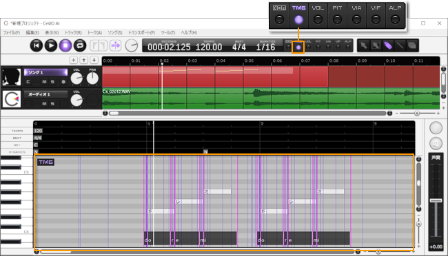

### 音符 / 音素单位的调整

选择「画笔工具」，拖动下方黑带里的线条来以音符为单位修改时间。

向前移动线条可以将时刻提前，向后移动可以将时刻延后。

拖动黑带上方的线，可以以音素为单位调整辅音或元音的长度。

### 状态线

从本质上讲，时间由歌词中每个音素（例如「ド」的「d」或「o」）的五条线组成，一条红紫色的**音素线**表示该音素的开始，四条浅紫色的**状态线**表示该音素的声音变化。

可以按 ++ctrl+i++ 键显示这些状态线，或者在「歌唱」菜单的「显示网格线」下打开「显示音素状态线」。按住 ++alt++ 键可以暂时切换。※通常情况下可以直接隐藏，有需要时再将它显示出来做调整。

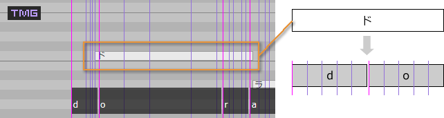

显示状态线时，可以以一条状态线为单位调整时间。

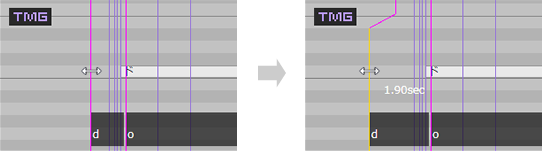

在显示状态线的状态下拖动黑带调整音素单位时，状态线也会自动调整。

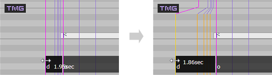

!!! info "关于参数变化"
    因为『CeVIO AI』会从乐谱整体推定演唱风格，所以当增加、删除音符，改变或编辑音符长度和音阶时，乐谱的各个部分的参数——如时间和音高——都会发生变化。

    由于时间调整值是相对于原始值而言的，因此当参数发生变化时，调整值也会发生变化。在这种情况下，每条时间线内跨越了相邻线的线将会被重置。

    （除时间外，音高等其他调整值是绝对值。）

### 元音时间修正

*母音のタイミング補正 / Vowel Timing Correction*

选择音符（或在 TMG 调整界面选择范围）后，从右键菜单中选择「元音时间修正」，可以将元音的发声时间自动调整到音符的起始处。

※辅音会随元音移动相同的数值（辅音无法移动时使用比率调整。如果没有足够的空间留给辅音则跳过）。

※鉴于机械修正可能会失去原先良好的听感，请将其用作辅助手段。

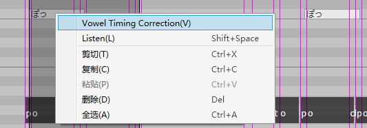

## 音量调整

*ボリューム調整 / Edit Volume*

在这里编辑音符的音量。

※也可以通过[强弱记号](../songtrack)轻松调整音量。

选择「画笔工具」，拖动线条来修改音量。

音量的单位为 dB（分贝）。

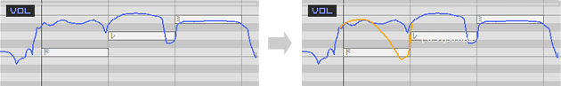

## 音高调整

*ピッチ調整 / Edit Pitch*

在这里调整音符的音高。仅调整基本音高，不包含颤音。

在音高调整界面以外，当叠加显示音高时，颤音影响后的音高也会一同显示。

在音高调整界面内，当叠加显示颤音的振幅或周期时，颤音影响后的音高也会一同显示。

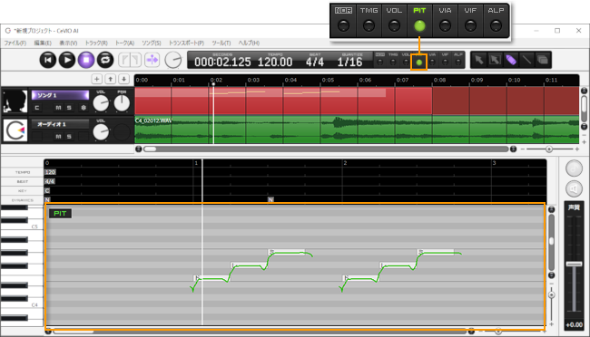

选择「画笔工具」，拖动线条来修改音高。

音高的单位是 Hz（赫兹）。

相对值的数值（括号内）的单位是 Cent，+100Cent 代表升高半个音。

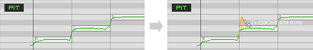

## 颤音的振幅调整

*ビブラートの振幅調整 / Edit Vibrato Amplitude*

颤音可以通过振幅和周期来调节，在这里调整颤音的振幅。

重叠显示音高将显示带有颤音的音高，以便于调整。

要在一个没有颤音的区域添加颤音，你需要在该区域同时画出振幅和周期。

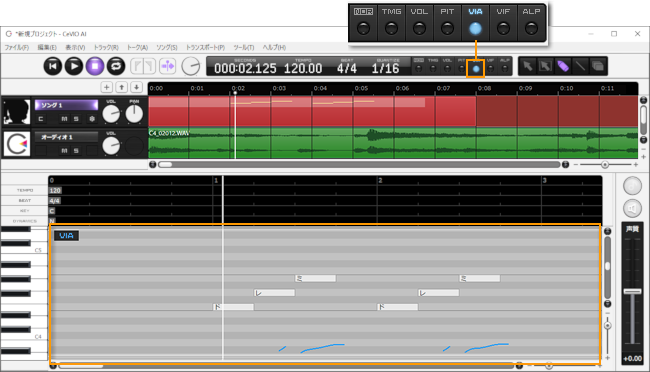

选择「画笔工具」，拖动线条来修改振幅。

振幅的单位是 Cent，100Cent 代表向上或向下摆动半个音。

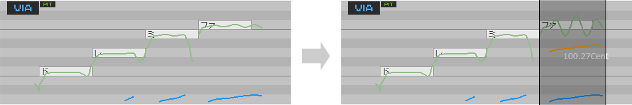

## 颤音的周期调整

*ビブラートの周期調整 / Edit Vibrato Frequency*

颤音可以通过振幅和周期来调节，在这里调整颤音的周期（频率）。

重叠显示音高将显示带有颤音的音高，以便于调整。

要在一个没有颤音的区域添加颤音，你需要在该区域同时画出振幅和周期。

选择「画笔工具」，拖动线条来修改周期。

周期的单位是 Hz（赫兹），表示每秒摇动的次数。

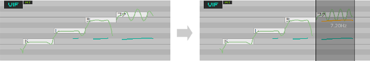
