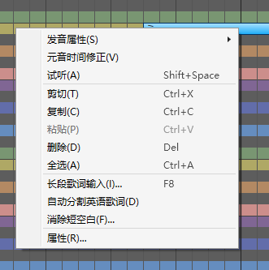

原文：[CeVIO AI ユーザーズガイド ┃ ソングトラックの説明](https://cevio.jp/guide/cevio_ai/songtrack/)

---
在钢琴卷帘中填入音符输入歌词，然后在调整界面进行细微调整。

菜单的「音轨」或者右键点击轨道选择「添加歌唱轨道」，最大可以添加 32 个轨道。

### 光标

点击标尺，可以移动想要开始播放的位置。

钢琴卷帘通常通过量化自动进行位置补正；按住 ++alt++ 键再点击则不会补正。

### 标尺

在小节行中，可以水平拖动鼠标（按住左键移动）来滚动。

在任意一行中垂直拖动都可以缩放。

曲速行/拍子行/调号行/强弱记号行的任意一行都可以在歌曲中间添加、编辑和删除信息，如在曲速行中间添加新的曲速。

※曲速行和拍子行默认不显示，但可以通过标尺栏前端和钢琴卷帘的右键菜单设置为显示。[^1]

### 试听

播放选择的音符前后的简单区间。在调整界面中则是播放选择范围的区间。

使用快捷键 ++shift+space++ 也可以进行试听。

### 自动试听

选择是否在输入音符后或移动音符后自动进行试听。

### 键盘

点击音阶，该轨道的角色会唱出这个音。

### 滚动条

当滚动条位于右端时，按住钢琴卷帘底部的滚动条的向右滚动按钮，或按住 ++shift++ 再向下滚动鼠标滚轮，可以往末尾追加小节。

### 缩放条

拖动缩放条以调整钢琴卷帘的缩放倍率。

## 右键菜单

在钢琴卷帘上右键单击（或在触摸屏上长按）来打开右键菜单。

### 选择 / 范围选择 / 画笔 / 直线 / 橡皮擦工具

*選択／まとめ選択／ペン／ライン／消しゴムツール*

*Selection / Collectively Selection / Draw / Line / Eraser Tool*

切换编辑工具。

[编辑工具](../../operation/edittool)

### 量化

*クオンタイズ / Quantize*

变更量化。

[量化是](../../operation/infopanel#音符量化)

### 参数调整

*調整モード / Edit Mode*

在用于输入音符和歌词的乐谱编辑模式和调整时间、音量、音高和颤音的模式间切换。

也可以禁用所选音轨的颤音。

### 剪切

*切り取り / Cut*

切取选择的音符。

### 复制

*コピー / Copy*

复制选择的音符。

### 粘贴

*貼り付け / Paste*

在光标当前的位置粘贴复制（剪切）的音符。

### 删除

*削除 / Delete*

删除选择的音符。

### 全选

*すべて選択 / Select All*

选择钢琴卷帘内的所有音符。

### 输入歌词

*歌詞のまとめ入力 / enter Lyrics Collectively*

一次性从当前选中的音符开始（若未选定的话则从头开始）插入歌词。

### 其他操作

#### 插入小节

*小節の挿入 / Insert Measures*

在指定的位置往所选音轨或全部音轨中插入小节。

也可以通过按住钢琴卷帘底部的滚动条的向右滚动按钮，或通过 ++shift++ + 下鼠标滚轮的方式往末尾追加小节。

#### 删除小节

*小節の削除 / Delete Measures*

在指定的位置往所选音轨或全部音轨中删除小节。

#### 消除短空白

*細かい空白の除去 / Remove Rests*

删除 MIDI 文件导入等原因导致的小空隙（休止符）。

### 按音素输入歌词

*音素で歌詞入力 / enter Lyrics with Phoneme*

按音素记号（发音记号）输入歌词。

开启该选项时，输入模式切换为音素输入模式，歌词输入栏的背景会变为蓝灰色。

!!! new

    ### 自动分割英语歌词的音节

    输入英语歌词时，按 1 音符 1 音节的方式分割单词并分配给音符。

    ※由于是自动推算，可能会有出错的情况。

### 显示

#### 显示其他音轨的音符

*別トラックの音符表示 / Other Track Notes*

选择是否要在乐谱编辑页面里显示所有歌唱轨道的音符。

(静音轨道不会被显示。)

#### 曲速行 / 拍子行 / 调号行 / 强弱记号行

*テンポ行／拍子行／調号行／強弱記号行*

*Tempo Row / Time Signature Row / Key Signature Row / Dynamics Mark Row*

修改标尺栏内曲速、拍子、调号、强弱记号的显示与否。

#### 拍子网格线 / 量化线 / 在调整界面也显示网格线

*拍のライン／クオンタイズのライン／調整画面にも表示*

*Beat Line / Quantize Line / Line Display on Adjustment Screen*

修改钢琴卷帘内拍子线、量化线的显示与否。

开启「在调整界面也显示网格线」时，调整界面中也会显示网格线。

!!! new

    ### 状态线

    修改TMG调整页面内状态线的显示与否。

    若选择隐藏，则状态线会自动调整。

#### 光标指示器

*ガイドカーソル / Guide Cursor*

修改标尺栏内当前鼠标对应量化位置的显示与否。

- 使用范围选择工具 / 画笔工具 / 直线工具时，该量化位置也会出现在乐谱编辑页面中。

### 属性

*プロパティ / Property*

浏览音符的详情，并为其设置重音、断音、呼吸音、连音与假音。

也可以选择多个音符，然后同时修改它们的设定。

[^1]:译者注：原文为强弱记号行，但从版本 8.2.5.0 起，强弱记号行与调号行一并改为默认显示，曲速行和拍子行改为默认隐藏。
