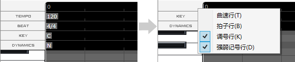
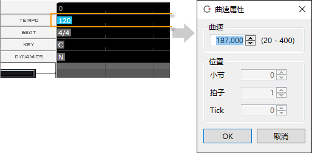
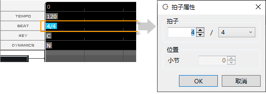
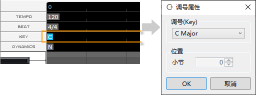
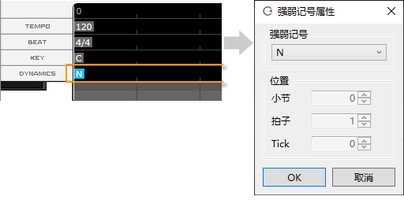

原文：[CeVIO AI ユーザーズガイド ┃ テンポ／拍子／調号／強弱記号](https://cevio.jp/guide/cevio_ai/songtrack/songtrack/)

---

在钢琴卷帘的标尺栏中可以修改、增加或删除曲速/拍子/调号/强弱记号。

对于新项目，位于 0 小节的开始处会有一个默认的设置。

在标尺栏的右键菜单里可以切换每一项的显示与否。

## 曲速的设置

在编辑工具里选择选择工具或画笔工具，然后双击曲速，便可变更曲速。

若想在歌曲中间修改曲速，请选择画笔工具，然后在想改变曲速的位置双击曲速行来设置新的曲速。

也可以通过向左或向右拖动（按住鼠标左键移动）或直接在曲速属性中指定位置的方式，来移动曲速（除了最初的曲速外）。曲速的位置通过量化补正。

※若从信息面板里修改了曲速，则会改变离光标最近的前一个曲速。

※所有歌唱轨道共享曲速的设定。

## 拍子的设置

在编辑工具里选择选择工具或画笔工具，然后双击拍子，便可变更拍子。

若想在歌曲中间修改拍子，请选择画笔工具，然后在想改变拍子的位置双击拍子行来设置新的拍子。

也可以通过向左或向右拖动（按住鼠标左键移动）或直接在拍子属性中指定位置的方式，来移动拍子（除了最初的拍子外）。

※若从信息面板里修改了拍子，则会改变前一个离光标最近的拍子。

※所有歌唱轨道共享拍子的设定。

!!! info "曲速和拍子的修改"
    曲速和拍子的修改会影响所有音轨。

    如果已经调整过了参数，则它们也会自动变换。

    请留意，举例来说，将曲速从 120 改到 180，每一个小时会丢失 1/3 的时间数据，所以此时将曲速调回 120 是无法完全还原数据的（虽然数据会被拉伸）。

    这时可以使用撤销回到之前的状态。

## 调号（key）的设置

在编辑工具里选择选择工具或画笔工具，然后双击调号，便可变更调号。

若想在歌曲中间修改调号，请选择画笔工具，然后在想改变调号的位置双击调号行来设置新的调号。

也可以通过向左或向右拖动（按住鼠标左键移动）或直接在调号属性中指定位置的方式，来移动调号（除了最初的调号外）。

※可以为每条歌唱轨道分别设置调号。

## 强弱记号的设置

设置强弱符号可以从这个位置开始自然地加强或减弱发声。

※效果依 [mf]→[f]→[ff] 的顺序变强，依 [mp]→[p]→[pp] 的顺序变弱，[N] 为正常力度。

※效果从指定的位置持续到下一个强弱记号。音量也会改变。

!!! new

    从版本 8.3.2.0 起, 你可以设置新的强弱记号「fff」「ffff」「ppp」「pppp」。
  
    ※受角色和乐谱的影响，跟「ff」「pp」相比，可能会有效果不明显的情况。

在编辑工具里选择选择工具或画笔工具，然后双击强弱记号，便可变更强弱记号。

若想在歌曲中间修改调号，请选择画笔工具，然后在想改变力度的位置双击强弱记号行来设置新的强弱记号。

也可以通过向左或向右拖动（按住鼠标左键移动）或直接在强弱记号属性中指定位置的方式，来移动强弱记号（最初的强弱记号除外）。

※可以为每条歌唱轨道分别设置强弱记号。
