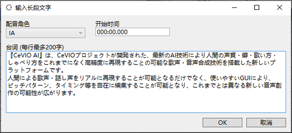
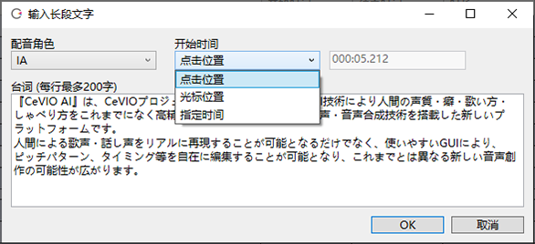

原文：[CeVIO AI ユーザーズガイド ┃ 文のまとめ入力](https://cevio.jp/guide/cevio_ai/talktrack/longsentence/)

---
当你想一次性输入一组句子而不是一次输入一行时，或者当你想在选定的行上插入文本时，「长段文本输入」选项就很方便了。

可以通过台词列表的右键菜单或者 ++f8++ 快速调出该界面。

浏览器等来自外部的文本也可以复制并粘贴其中，导入长文更为便捷。

在时间轴上通过右键菜单调出「长段文本输入」时，文本将插入到鼠标点击或是光标所在的地方。

### 配音角色

说出这句台词的角色。

### 开始时间

在指定的时间点插入文本。默认值为选中行的开始时间（分:秒.微秒）。

### 开始时间（在时间轴上通过右键菜单调出的情况）

#### 点击位置

在右键单击的位置插入文本。

#### 光标位置

在光标的位置插入文本。

#### 指定时间

在指定的时间点插入文本。默认值为右键单击的位置。

### 台词

角色要说的文本。换行时台词会自动分割到新的行中。

一句话超过 200 字时，将优先按照标点符号将文本分割到 200 字以内。

!!! tip "状态和感情"

    选中行的状态（音量、语速、音高、音色、语调）和感情会应用到台词中。

    预先设好参数或预设，再输入文本，便可以轻松为它们批量设置。
    
    即使输入已经完成，也依旧能通过选择预设时按住 ++alt++ 的方式，来为该音轨的角色批量设置预设。

--8<-- "includes/abbreviations.md"
