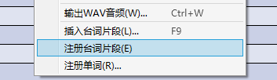
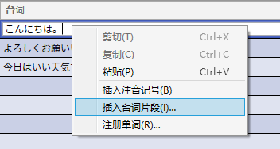
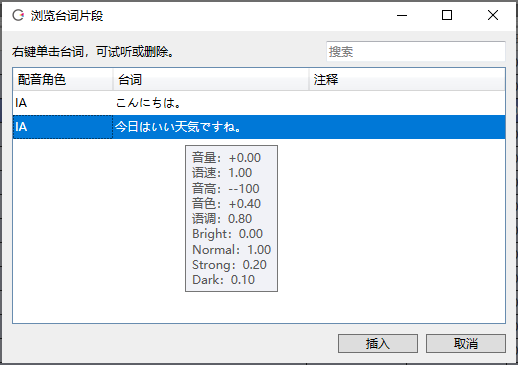

原文：[CeVIO AI ユーザーズガイド ┃ セリフクリップ](https://cevio.jp/guide/cevio_ai/talktrack/phrasececlip/)

---

## 注册台词片段

将调整完毕的台词注册为台词片段，就可以简单地重复利用它们。

右键菜单里的「注册台词片段」可以注册选中行的台词。

状态（音量~语调）、情感和调整过的音素图等调整内容也会一并注册。

同一句台词可以注册多种不同的调整以供使用，也可以选择覆盖以前的注册。

!!! info "与注册单词的关系"

    注册台词片段时，对音素图的调整也会一起注册，但原始单词的重音会随着注册单词而改变。

    * 也有更新后随着系统字典的更新而发生变化的可能。

## 插入台词片段

右键菜单里的「插入台词片段」可以选择已注册的台词片段并插入到选中行中。

即使是正在输入台词的情况下，也可以通过右键单击从菜单里选择「插入台词片段」来在光标位置插入台词片段。

* 该行的状态和情感等值将变为台词片段的值。

## 浏览台词片段

在台词片段列表中，可以选择一句台词并按「插入」按钮插入。

右键菜单可以试听或删除选中的台词。

点击列的标题（配音角色/台词/注释），可以暂时重新排序。

### 配音角色

说出这句台词的角色。

### 台词

台词的内容。鼠标移至该栏会显示该台词的状态、情感等值。

### 备注

用于备注，例如区分同一句台词的不同调整。允许留空。

### 搜索台词

将显示范围缩小到与台词或备注部分匹配的台词。

输入由空格隔开的多个单词时会使用 OR 搜索。可以使用通配符（`*` 和 `?`）。

※若要将台词片段转移到另一台电脑上，请移步[常见问题](../faq/faq.md)。

*[「注册台词片段」]: セリフクリップの登録 / Register Speech Clip
*[「插入台词片段」]: セリフクリップの挿入 / Insert Speech Clip
