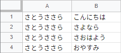

原文：[CeVIO AI ユーザーズガイド ┃ セリフのインポート](https://cevio.jp/guide/cevio_ai/talktrack/talk_04/)

---

可以预先创建一个文本文件写好台词，然后导入。

选择待导入台词的语音轨道，然后从菜单中选择「文件」→「导入」→「导入台词文本」并指定文件。

!!! info "关于文件格式"

    除了能用表格软件生成的 CSV 文件外，也接受每行只写了台词的纯文本文件，以及按「角色名,台词」或「角色名,台词,预设名」编写好的纯文本文件。

    * 可以使用 `Tab` 和半角逗号 `,` 作为分隔符（允许混用）。
    * 指定角色时应使用「さとうささら」等下文列出的角色名。
    * 如果第一列的内容（第一个分隔符前）与角色名匹配，则它将作为角色设置读入，否则它将被视作为台词。
    * 如果第三列的内容（第二个分隔符后）与预设名匹配，则它将作为预设设置读入，否则它将被视作为包含了逗号的台词。
    * 一句话的字数超过 200 时将自动分割。最多能读取 1000 行。
    * 文件的扩展名应保存为 `.txt` 或 `.csv`。

!!! example "数据示例"

    表格：

    

    纯文本：

    ```txt
    『CeVIO AI』は、CeVIOプロジェクトが開発された、最新のAI技術により人間の声質・癖・歌い方・しゃべり方をこれまでになく高精度に再現することの可能な歌声・音声合成技術を搭載した新しいプラットフォームです。人間による歌声・話し声をリアルに再現することが可能となるだけでなく、使いやすいGUIにより、ピッチパターン、タイミング等を自在に編集することが可能となり、これまでとは異なる新しい音声創作の可能性が広がります。
    ```

    ```txt
    さとうささら,こんにちは
    さとうささら,さよなら
    さとうささら,さおはよう
    さとうささら,おやすみ
    ```

    ```txt
    IA,天気が良いから、散歩しましょう。,Smile
    ONE,天気が良いから、散歩しましょう。,Smile
    ```

!!! info "关于角色名"

    指定角色时可以使用以下名字。

    |  |  |  |
    | --- | --- | --- |
    | さとうささら | 小春六花 | 弦巻マキ (日) |
    | IA | 夏色花梨 | 弦巻マキ (英) |
    | OИE | フィーちゃん | ロサ (ROSA) |
    
    ※也可以使用「ONE」作为「OИE」的名字。

!!! info "关于文字编码"

    在记事本和 Google 表格中，文件以「UTF-8」的格式保存；Excel 的 CSV 文件是「Shift-JIS」，也可以选择「CSV UTF-8」。如有必要，请在「语音设定」选项内「文本文件的编码」的「导入」中指定字符代码。

!!! tip "状态和感情"

    如果待导入文件中未指定预设，则选定行的感情、音量、语速等参数将会应用到导入的台词中。预先设好参数会让导入更容易。
    
    即使导入已经完成，也依旧能通过选择预设时按住 ++alt++ 的方式，来为选中的行批量设置预设。

--8<-- "includes/abbreviations.md"
