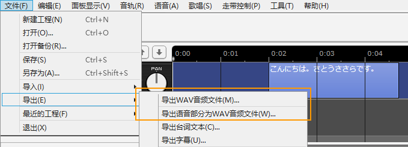

原文：[CeVIO AI ユーザーズガイド ┃ はじめてのトーク作成](https://cevio.jp/guide/cevio_ai/tutorial_talk/)

---

无论是对话，抑或是旁白，都可以利用 CeVIO 创作出适合的声音。

轻轻一点就可以使用诸如「元気一杯」「哀しげ」等预设好的情绪[^1]，并更进一步地调整音量和语速等细节。

## 1.启动应用

启动软件后，音轨将在页面的上方显示。

* 如果有多个音轨，点击写着「语音 1」的音轨（或者时间轴），页面的下方将会出现语音编辑界面。

## 2.输入台词

在语音编辑界面里选择一行，然后单击该行并输入文字。

## 3.台词的发声时间

输入台词后，一个台词的元素（方块）会出现在时间轴上。拖动（鼠标左键按住并移动）元素来更改发声的时间。

## 4.选择角色

拥有多个可使用的角色时，可以在配音角色栏选择说出这一行台词的角色。

## 5.情绪的设置

轻轻一点语音编辑界面右侧的预设就能设置角色的情绪。

也可以使用情绪控制（条形图的推子）来混合多种情绪。

## 6.试听

按下试听按钮可以试听选中的台词。

## 7.导出声音文件

通过菜单的「文件」→「导出」→「导出WAV音频文件」，可以将全部音轨合成一个文件并导出。

另外，也可以通过「导出语音部分为WAV文件」，将每句台词分别导出。

[^1]: 译者注：这两个都是莎莎拉的情绪预设名，分别是「元気」拉满和「哀しみ」拉满

*[「语音 1」]: トーク１ / Talk 1

--8<-- "includes/abbreviations.md"
